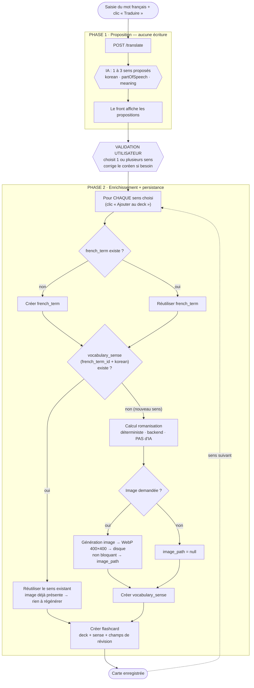

# Workflow — Création d'une flashcard

Décrit le parcours complet de création d'une carte, de la saisie du mot français
jusqu'à la persistance. Sert aussi de guide d'ordonnancement des tickets (voir la
table de correspondance en bas).

## Principe clé

Le workflow se divise en **deux phases séparées par une action humaine** :

1. **Phase 1 — Proposition** : l'IA propose, **rien n'est écrit** (ni en base, ni sur disque).
2. **Validation utilisateur** : l'utilisateur choisit un sens (ou plusieurs), corrige, valide.
3. **Phase 2 — Enrichissement + persistance** : romanisation, image optionnelle, écriture en base.

Conséquences directes :

- L'IA n'est appelée qu'en Phase 1 (traduction) et, si demandé, à la génération d'image en Phase 2. **Jamais ailleurs.**
- Les propositions de `/translate` sont **transitoires** : la requête de création doit transporter *toutes* les données validées (HTTP est sans état, le backend ne « retrouve » pas la traduction précédente).
- La romanisation est calculée en Phase 2, à partir du coréen **validé** (déterministe, jamais via l'IA).
- Les appels externes (IA, image) ne sont **pas** transactionnels : l'image se génère *avant* la transaction de persistance, et son échec ne bloque pas la création de la carte.

---

## Diagramme



---

## Version texte

```text
── PHASE 1 · Proposition (AUCUNE écriture) ──────────────
Saisie "avocat" + clic "Traduire"
        ↓
POST /translate  →  l'IA renvoie 1 à 3 sens proposés
        ↓            (korean, partOfSpeech, meaning)
Le front affiche les propositions — rien en base, rien sur disque

── PIVOT · Validation utilisateur ───────────────────────
Choix d'UN sens (ou plusieurs → plusieurs cartes),
correction du coréen si besoin, validation.

── PHASE 2 · Enrichissement + persistance ───────────────
(pour chaque sens choisi, au clic "Ajouter au deck")

  french_term      → trouve "avocat" ou le crée
        ↓
  vocabulary_sense → existe (french_term_id + korean) ?
        │
        ├─ oui  → réutilise le sens + son image (rien à régénérer)
        │
        └─ non  → romanisation (backend, déterministe)
                  → image optionnelle → WebP 400×400 → image_path
                  → crée vocabulary_sense
        ↓
  flashcard        → crée la carte (deck + sense + champs de révision)
        ↓
  Carte enregistrée
```

---

## Points d'attention

- **Vérifier l'existence du sens tôt.** Comme un sens existant réutilise son image, inutile de générer (et payer) une image avant de savoir si le sens est nouveau. Checker `(french_term_id, korean)` avant l'étape image évite un appel image inutile et un fichier orphelin.
- **Image hors transaction.** Générer et stocker l'image *avant* d'ouvrir la transaction DB, puis ne passer que le `image_path` (ou `null`) à la persistance. La transaction reste courte et purement locale.
- **Concurrence sur le sens.** La contrainte `UNIQUE (french_term_id, korean_term)` protège contre deux créations simultanées du même sens : tenter l'insert, et sur violation d'unicité, relire l'existant plutôt que planter.
- **Cas « créer les deux cartes ».** La Phase 2 boucle sur chaque sens retenu : `french_term` créé une fois, puis un `vocabulary_sense` + une `flashcard` par sens.

---

## Correspondance workflow → tickets → phase

Cette table donne l'**ordre d'implémentation** : une étape ne peut se coder que si les
étapes dont elle dépend existent. D'où l'ordre global **P1 (entités) → P2 (traduction +
romanisation) → P3 (image + orchestration)**.

| Étape du workflow | Tickets backend concernés | Milestone |
|---|---|---|
| Entités `deck` / `french_term` / `vocabulary_sense` / `flashcard` | Entité Deck · Entité Flashcard · Relation Deck ↔ Flashcard · Enum PartOfSpeech + champs de révision | **P1** |
| `POST /translate` + propositions IA | Configurer le client OpenAI · Service de traduction (Structured Output) · Validation de la réponse IA · Endpoint POST /translate · Résilience des appels IA · Mots ambigus | **P2** |
| Calcul de la romanisation | Spike KOROMAN vs maison · Service de romanisation · Tests unitaires romanisation | **P2** |
| Génération + stockage image | Client génération image OpenAI · Abstraction ImageStorageService · Optimisation WebP · Échec image non bloquant | **P3** |
| Persistance « trouve ou crée » + boucle multi-sens | Créer une flashcard · Orchestrer le workflow de création | **P3** |
| Validation utilisateur (choix du sens) | *Frontend (Vue 3) — autre dépôt* | — |

> **À retenir pour l'ordre :** le ticket **« Orchestrer le workflow de création »** (P3) est
> le dernier maillon — il assemble tout le reste. Ne l'attaque qu'une fois les entités (P1),
> la traduction et la romanisation (P2), et le pipeline image (P3) en place.
