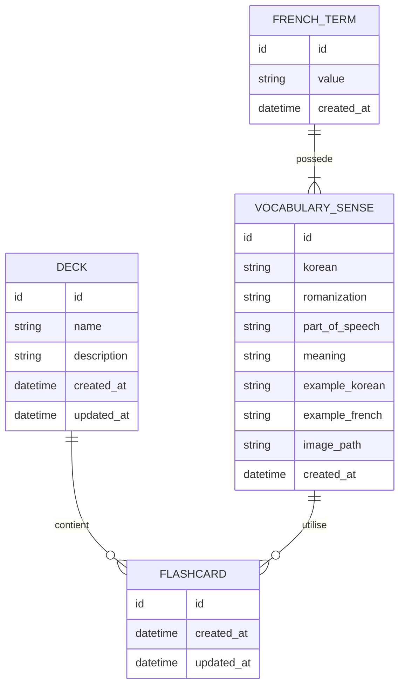

```mermaid
erDiagram

    DECK ||--o{ FLASHCARD : contient

    FRENCH_TERM ||--|{ VOCABULARY_SENSE : possede

    VOCABULARY_SENSE ||--o{ FLASHCARD : utilise

    DECK {
        id id
        string name
        string description
        datetime created_at
        datetime updated_at
    }

    FRENCH_TERM {
        id id
        string value
        datetime created_at
    }

    VOCABULARY_SENSE {
        id id
        string korean
        string romanization
        string part_of_speech
        string meaning
        string example_korean
        string example_french
        string image_path
        datetime created_at
    }

    FLASHCARD {
        id id
        datetime created_at
        datetime updated_at
    }
```